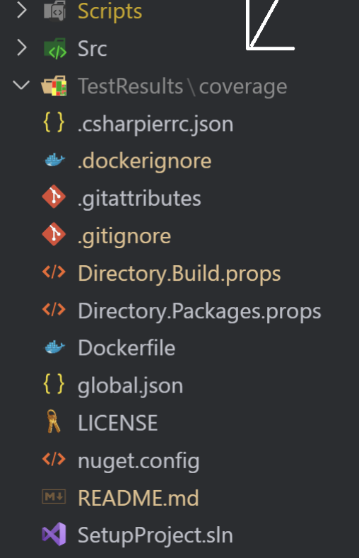
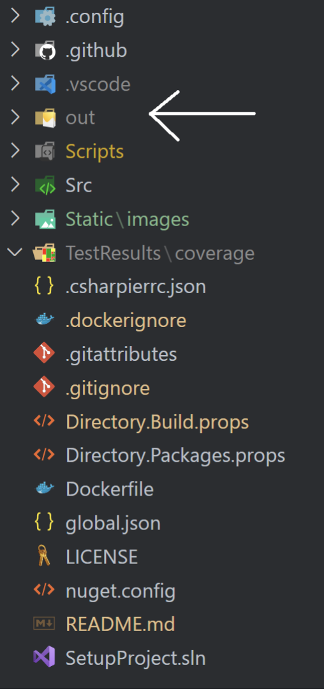

# ASPNET_CORE_VSA_Template

## TL;DR

- The ASP.NET Core template follows the Vertical Slice Architecture (VSA).

- Please leave the name of the repository folder that you have cloned as `ASPNET_CORE_VSA_Template` (default) in order to make the scripts work or check out **how to make scripts work** with different folder name [Here](./Static/Docs/ConfigExplaination/CustomizeScript.md).

- For **explanations about idea and structure of template**, please check out [Here](./Static/Docs/TemplateExplaination/AGentleIntroduction.md)

- For more **information about each config file**, please check out [Here](./Static/Docs/ConfigExplaination/Introduction.md)

- For how to **start the project**, please check out [Getting Started](#getting-started)

## Introduction

Welcome to the ASP.NET Core Vertical Slice Architecture Template! This template helps you build maintainable, scalable, and testable web applications by organizing code around business features. It addresses the challenges of traditional layered architectures, such as bloated controllers and scattered code, by promoting a modular and feature-centric approach.

## Context

In the past, I often followed tutorials to build projects, but I encountered significant challenges with the project structures they suggested. Here are some common issues I faced:

- **Long service files**: These became difficult to maintain as they grew in size.
- **Scattered context**: Retrieving all the information related to a feature was challenging because methods and classes were spread across multiple files and folders.
- **Fat controllers**: Controllers often became bloated and hard to manage.

I realized that this approach, known as **technical-based architecture**, groups all files of the same type (e.g., services in a `Services` folder). While this approach seemed organized, it often led to inefficiencies. To address this, I researched **feature-based architecture**, which has the following advantages:

- Each feature has its own dedicated folder, making the structure easier to navigate.
- All files related to a feature are stored together, simplifying maintenance.

However, even with a feature-based architecture, I encountered new challenges as the project grew:

- **Class naming conflicts**: With multiple feature-related classes in one project, it was easy to mistype or confuse class names (e.g., `FM1Endpoint` vs. `FM2Endpoint`).

To solve this, I decided to move each feature into its own class library. This approach makes it impossible to call classes from one feature without explicitly referencing its assembly (e.g., `FM1Endpoint` cannot be called from assembly containing `FM2Endpoint`), reducing the chances of errors.

And that’s how this template was born!

## Demo video

[Coming soon]()

## Getting Started

### Prerequisites

Ensure you have the following installed:

- .NET SDK `8.0.404`

- Docker (Any version but at least `20.10.17`)

  - please make sure it supports docker compose

- `Text editor` (Vs code, fleet,..) or `IDE` (Visual Studio 2022, Rider, ...)

### Installation

Clone this project via this command:

```bash
git clone https://github.com/Jackpieking/ASPNET_CORE_VSA_Template.git
```

## Usage

### 1. Navigate to the root of the template

- #### Windows

```bash
cd E:\CODE_PROJECTS\ASPNET_CORE_VSA_Template\
```

- #### Mac/Linux

```bash
cd /home/CODE_PROJECTS/ASPNET_CORE_VSA_Template/
```

### 2. Install necessary dotnet tool via this script:

- #### Windows

```bash
.\Scripts\Init\init.ps1
```

- #### Mac/Linux

```bash
./Scripts/Init/init.sh
```

### 3: Update the **`HOST_IP`** var in `.env` file in `./AppInfrastructure` folder (docker stack)

For example:

Currently, in `.env` there is a section at the top expressing docker server IP:

```bash
# ======================
# GLOBAL
# ======================
HOST_IP=192.168.56.104
```

But your docker server IP is `192.168.1.10`, so you must change it to:

```bash
# ======================
# GLOBAL
# ======================
HOST_IP=192.168.1.10
```

### 4: Run docker compose by following command, make sure to stand in `./AppInfrastructure` folder:

```bash
docker compose up -d --build
```

### 5: Find and update the all parts that have `IP` in all `files` that start with `appsettings` in `Src/Entry` folder

For example:

Currently, in `appsettings.Development.json` in `Src/Entry` ther was a connection string for postgressql database like this:

```json
"Database": {
    "Main": {
      "ConnectionString": "Server=192.168.56.104; Port=6102; Database=todoappdb; User ID=admin; Password=Admin123@; SSL Mode=Prefer; Pooling=true; Minimum Pool Size=64; Maximum Pool Size=120; Connection Idle Lifetime=300; Connection Lifetime=500",
      // ... other settings
    }
  }
```

The current postgres server IP is `192.168.56.104`, but your server IP is `192.168.1.10`, so you must change it to:

```json
"Database": {
    "Main": {
      "ConnectionString": "Server=192.168.1.10; Port=6102; Database=todoappdb; User ID=admin; Password=Admin123@; SSL Mode=Prefer; Pooling=true; Minimum Pool Size=64; Maximum Pool Size=120; Connection Idle Lifetime=300; Connection Lifetime=500",
      // ... other settings
    }
  }
```

### 6. Run the project via this script:

- #### Windows

```bash
.\Scripts\Run\run.ps1
```

- #### Mac/Linux

```bash
./Scripts/Run/run.sh
```

## Other usage

### 1. Build the project via this script:

- #### Windows

```bash
.\Scripts\Build\build.ps1
```

- #### Mac/Linux

```bash
./Scripts/Build/build.sh
```

### 2. Test the project via this script:

- #### Windows

```bash
.\Scripts\Test\test.ps1
```

- #### Mac/Linux

```bash
./Scripts/Test/test.sh
```

--> The result will be in `TestResults` folder, the content inside will be always the newest.



### 3. Publish the project via this script:

- #### Windows

```bash
.\Scripts\PublishApp\publish.ps1
```

- #### Mac/Linux

```bash
./Scripts/PublishApp/publish.sh
```

--> The result will be in `out` folder, the content inside will be always the newest.



### 4. Clean the project via this script:

- #### Windows

```bash
.\Scripts\Clean\clean.ps1
```

- #### Mac/Linux

```bash
./Scripts/Clean/clean.sh
```

## License

This project is licensed under the [MIT License](https://github.com/Jackpieking/VerticleSliceArchitectureTemplate/blob/master/LICENSE), allowing you to freely use, modify, and distribute it under the terms of the license.

## Contact

Please submit any problems or questions related to this project on [GitHub issues](https://github.com/Jackpieking/ASPNET_CORE_VSA_Template/issues).
