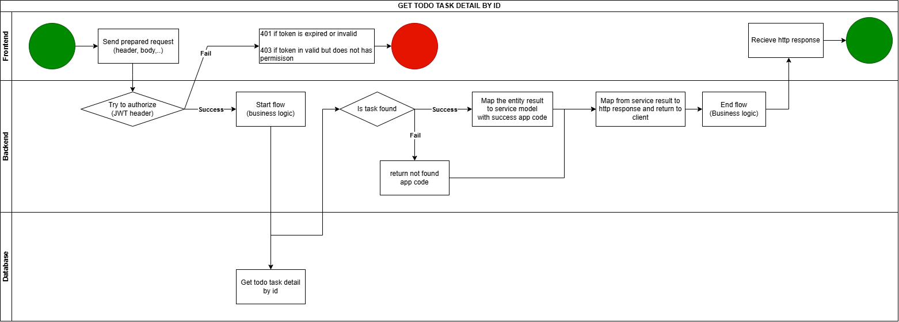
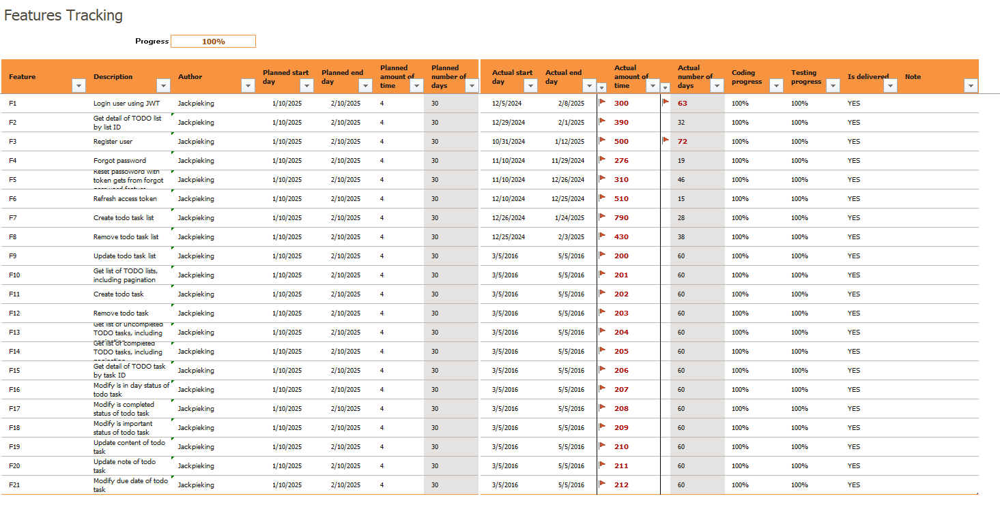

# PART 1 - FEATURE EXPLANATION

This document outlines a proposed approach to defining, designing, and managing features within an application.

### Defining Features

As I have discussed in **[Gentel Introduction](../AGentleIntroduction.md)**, a feature is defined as a **self-contained unit of functionality** within an application and an application is composed of **multiple features**, each with its own components, requirements, and dependencies.

Before development begins, each feature should be carefully designed. This includes defining its workflow, inputs, outputs, and dependencies. A visual representation of the workflow, using a diagram, is highly recommended. This diagram serves as a valuable tool for understanding the feature's logic and can save significant time compared to deciphering code directly. While input/output can be documented using tools like Swagger, detailed documentation can also be included if necessary.

**Example Feature Flow:**

The example diagram illustrates the flow for retrieving details of a to-do task by its ID, including authorization. The diagram provides a clear and concise overview of the process.

**Recommendation:**

Creating a flow diagram for each feature is strongly encouraged. However, the feasibility of this practice depends on project constraints and available time. Consider the following question:

- Do we have the resources to design and maintain these diagrams effectively?

### Managing Features

Applications often contain numerous features. Without proper planning and documentation, managing and tracking these features can become challenging.

**Challenges of Poor Feature Management:**

- Lack of understanding of each feature's purpose.
- Inability to track time spent on individual features.
- Difficulty monitoring the progress of each feature.
- **And many other potential issues.**

To address these challenges, a feature management document (e.g., in a spreadsheet, jira, or similar) is recommended. Due to the fact **this project is a template**, some information in this document **may not be entirely accurate**. However, it reflects the typical format used for feature management.

**Example Feature Management Document:**

The document above provides a centralized location for information about each feature, facilitating better organization and tracking. It helps to mitigate the risks associated with poor feature management. This document can be found **[Here](../FeatManagementDoc.xlsx)**

---

**FINISH READING?**

**==> CHECK OUT [PART 2](Part2.md)**
