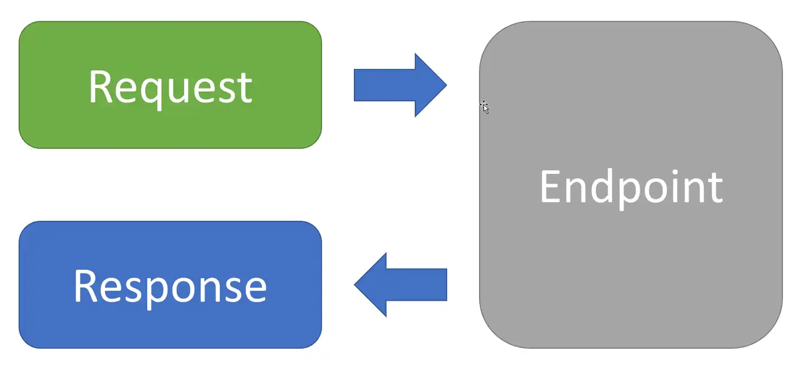
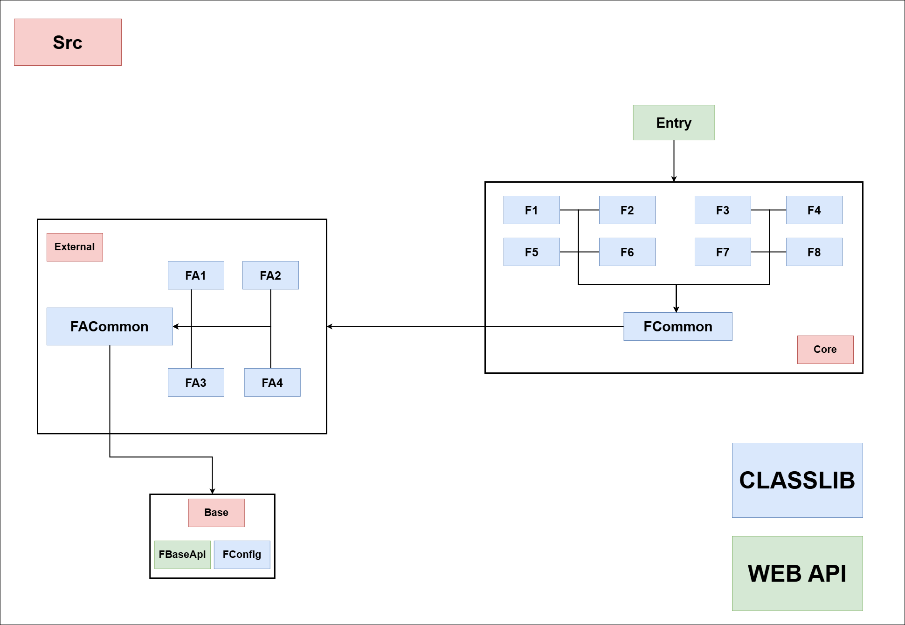

# PART 2 - ARCHITECTURE EXPLANATION

This document describes the Vertical Structure Architecture (VSA) used in this project, focusing on how features and their dependencies are organized.

### Recall

As discussed in [Part 1](./Part1.md), a feature comprises several components, including:

- Inputs
- Outputs
- Dependencies
- **And more**

**1. Features and Sub-Features:**

A _feature_ represents a specific functionality of the application. Features are composed of inputs, outputs, dependencies, and other components. Often, a feature has multiple stages or related functionalities, which are called _sub-features_. In this project, each feature currently has only one sub-feature. If a feature had multiple sub-features, documentation would explain their roles and how they contribute to the overall feature.

**2. REPR Pattern:**

Each sub-feature (or, in the case of a single sub-feature, the feature itself) is implemented as a module following the REPR (Request-Endpoint-Payload-Response) pattern. This pattern ensures a consistent structure for handling requests, defining endpoints, and managing data.

**3. Project Structure (VSA):**

The project is organized into several key folders:

- **Base:** This folder contains foundational code shared by all other modules. It provides core services and utilities used throughout the application.

- **Entry:** This folder contains the application's entry point. It's responsible for assembling the application by linking together the necessary modules. The `app-assembly.json` file acts as a configuration file, specifying which modules should be included in the build. This allows for flexible and manageable startup logic.

- **Core:** This folder houses the **core logic** of the application, organized into sub-feature modules. These modules are named with the prefix "F" followed by a unique code (e.g., F1, F2, etc.). A common module, "FCommon," provides shared functionality within the Core folder.

- **External:** This folder contains modules that integrate with external libraries and services. These modules are named with the prefix "FA" followed by a unique code (e.g., FA1, FA2, etc.). A common module, "FACommon," provides shared functionality within the External folder.

**4. External Library Integration:**

The "External" folder plays a crucial role in managing external dependencies. Each external library or service integration resides in its own dedicated module. For example:

- **FA1 (EF Core/Npgsql with PostgreSQL):** Handles the integration with the PostgreSQL database using EF Core and Npgsql. This module encapsulates the complexities of database schema mapping and configuration.

- **FA3 (Snowflake ID Generator):** Integrates the Snowflake ID generator. Even if the integration is currently simple, it's placed in its own module for future flexibility.

**5. Reasons for Modularizing External Libraries:**

- **Reusability:** These integration modules are designed to be reusable across multiple projects.

- **Complexity Management:** Integrating external libraries can be complex. Modularization isolates this complexity, making it easier to manage and maintain. Even simple integrations are separated to prepare for potential future complexity.

- **Maintainability:** Changes to external libraries or integration requirements are isolated within their respective modules, minimizing the impact on other parts of the system.

**6. Module Dependencies:**

The modules have the following dependency structure:

- **Base:** All modules depend on the Base module for core services.

- **External:** External modules (FA\*) depend on the Base module and implement the integration with specific external libraries.

- **Core:** Core modules (F\*) depend on the Base module and the necessary External modules to access external services.

- **Entry:** The Entry point depends on the modules specified in `app-assembly.json`, which typically includes Core and External modules.

**7. Summary:**

- This architectural approach centers around the **Core** module, which acts as the heart of the project. All business logic, interfaces, and other business-related classes reside within the Core.

- The **External** modules serve as suppliers, providing the necessary integrations and dependencies that the Core requires to function. Essentially, the Core encapsulates the application's core functionality, while the External modules provide the supporting infrastructure.

---

**FINISH READING?**

**==> CHECK OUT [PART 3](Part3.md)**
